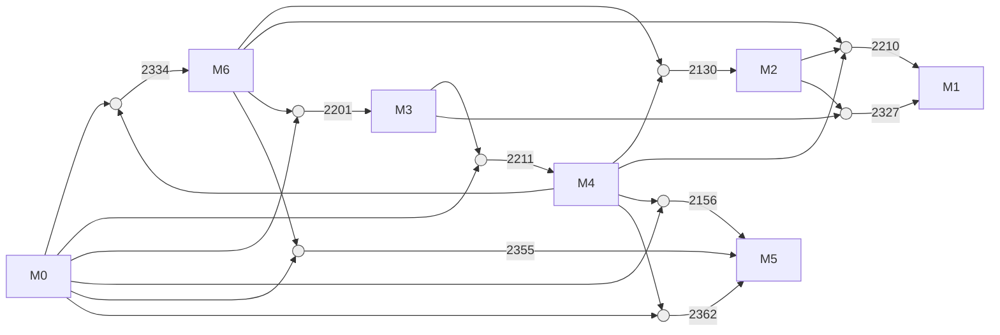
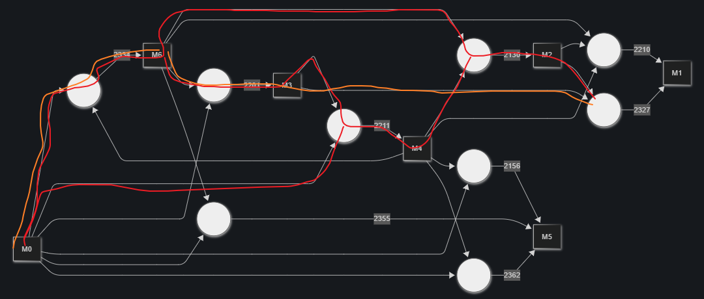
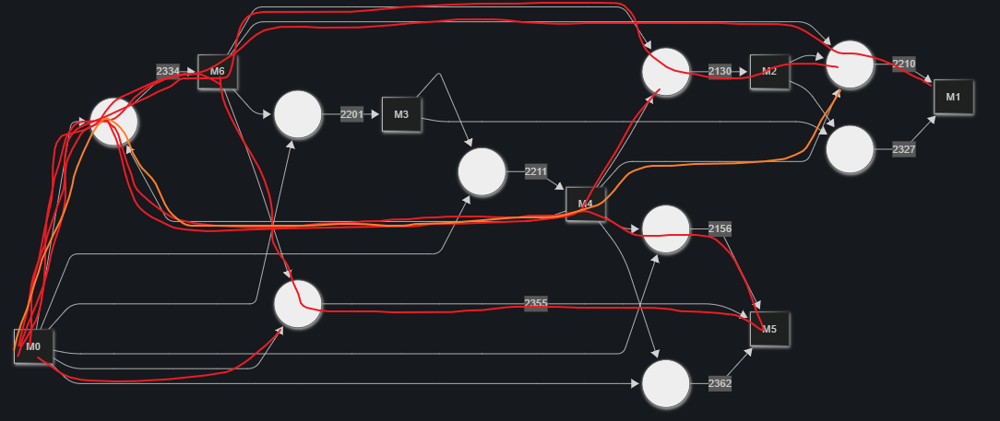
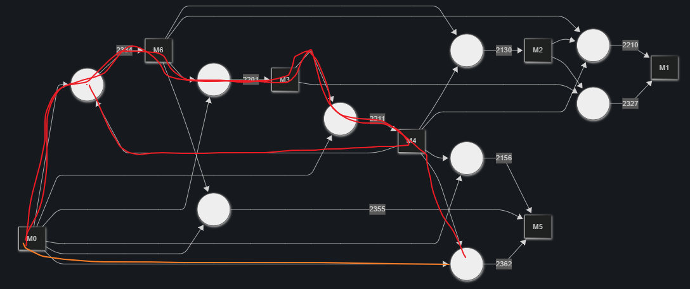
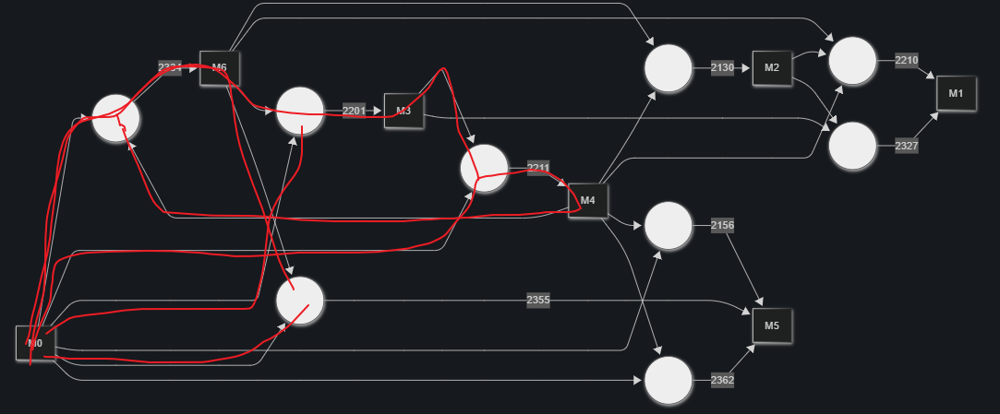
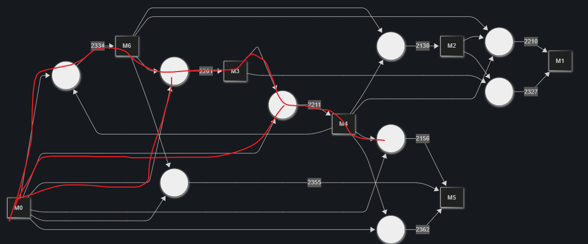

# Writeup

## Initial reverse engineering

By taking a look at the plugin.dll and loading msvc modules with pdbs (thanks microsoft!), we can see it hooks a `ReadFunction` function, that returns `tagFUNC*`, then it iterates through tuples stored in this function, and depending on the tuple kind it does *something*.

## What it is doing depending on the tuple kind

Essentially it's an alchemy game, you have N base elements. By crossing elements you get new element, the goal is to get to the `333, 727, 353, 746, 433, 765, 361` material counts. Initially we're given `1844, 0, 0, 0, 3004, 0, 2915`.

## Figuring out node kinds

Let's first ask ourselves, which do we need? Our goal is to get all elements, none of them are 0, so we must use conversions to all materials.

We'll go through the interactions one by one, but first, let's define the material types. I will be referring to them as M0-6, where the number after M is their (1 << N) number. The number on top of the arrow that defines conversion is the ast tuple kind it wants.

We have these conversions


Looks a bit chaotic, but it does give a good representation of all conversions. Here's again the table of all materials what conversions do they have.

| Result material | Tuple kind                                     | Initially given count |
|-----------------|------------------------------------------------|-----------------------|
| M0              | None, we can't get this material from anything | 1844                  |
| M1              | 2327, 2210                                     | 0                     |
| M2              | 2130                                           | 0                     |
| M3              | 2201                                           | 0                     |
| M4              | 2211                                           | 3004                  |
| M5              | 2362, 2355, 2156                               | 0                     |
| M6              | 2334                                           | 2915                  |

The fact that we don't have any conversion for M0 makes sense, this is one of the base elements we're crafting from after all.

Now, M1 and M5 have multiple producers, which ones do we want to use? Let's keep thinking.

Let's take a closer look at the chain of reactions that we need to do in order to get the elements needed for conversion.

### M1

Starting with M1, specifically conversion 2327



Ok, now 2210



### M5

conversion 2362:



conversion 2355:



conversion 2156:




### So which ones do we want to use?

First of all we're excluding the reactions for materials we're already given. We don't want to craft those, this means 2211 and 2334 are out.

Now, let's go with the simplest path. For M1 it's 2327, for M5 it is 2156.

Let's also map them to the names and figure what produces what. I will omit this detail, even though it might not be too obvious, I feel like giving the broad overview is already straightforward enough:

I was hooking into the same `ReadFunction` function, feeding compiler the example .cpp file and was reading through the produced nodes. From that you can either match them yourself, or just use any llm, as this is just work with text at this point, no fancy knowledge is required to just map things around.

This leaves us with these types of nodes:
- 2130: SimpleStmt 
- 2201: FunctionCallStmt
- 2156: ReturnStmt
- **2327: DestructorEHBlock**

Now, 2327 is the most annoying node kind i found while exploring. From my testing, to get the 2327(DestructorEHBlock) into the code it takes some effort.

Because of that in my solution I decided to go with the 2210 instead for M1, it is a much *easier* target.

From author's perspective 2327 is some sort of a cheat code you can use if you can, the challenge doesn't limit amount of solutions so you can achieve the needed counts however you want, so while it *does* seem like an *easier* target, upon further inspection it doesnt prove to be a viable candidate either because you can't produce it with your code, or because the other ones are *easier*. By easier I mean that usually one line of code produces multiple nodes, and golfing your payload to satisfy all numbers of reactions (by producing the needed number of nodes in a specific order) might seem annoying.

So instead of 2327 i picked 2156, which is way *easier*

- 2156: ReturnStmt

This leaves us with
- 2210: ThrowStmt
- 2130: SimpleStmt
- 2201: FunctionCallStmt
- 2156: ReturnStmt

Here is a table expresssions I used for my solution:

| C++ line                                 | Tuple sequence                                      |
|------------------------------------------|-----------------------------------------------------|
| `int a = 1;`                             | `SimpleStmt`                                        |
| `throw;`                                 | `FunctionCallStmt`, `ThrowStmt`, `FunctionCallStmt` |
| `return 0;`                              | `ReturnStmt`                                        |
| `reinterpret_cast<void(*)()>(nullptr)()` | `FunctionCallStmt`                                  |


## Finding the payload

Check out `playground/solve.py`, there are some bugs in it so i had to find the close-enough target elements count my thing can solve for with given constraints, and solve for it. Then adjust payload by hand. Some annoying bugs I put up with:
* x[THROW_ID] == x[CALL_ID], this is *somewhat* wrong
* target[1], target[3] have to be equal to eachother because i didn't add more rules to the solver itself

This produced the attached `solution.cpp`

## Manually golf to get it to the final values

By looking at the reactions and our counts, all the previous reactions still can be used here, but after my conversions we were still short on M5, I didn't go for ReturnStmt this time because I needed to keep the materials it uses. Instead I went for the 2362, which is `BeginEpilogue`, that can be produced like this:

| C++ line                                 | Tuple sequence                                      |
|------------------------------------------|-----------------------------------------------------|
| `{}`                                     | `FunctionPrologue`, `BeginEpilogue`                 |

Then manually I crafted this additional payload:

```cpp
    reinterpret_cast<void(*)()>(nullptr)();
    reinterpret_cast<void(*)()>(nullptr)();
    reinterpret_cast<void(*)()>(nullptr)();
    reinterpret_cast<void(*)()>(nullptr)();
    reinterpret_cast<void(*)()>(nullptr)();
    reinterpret_cast<void(*)()>(nullptr)();
    reinterpret_cast<void(*)()>(nullptr)();
    reinterpret_cast<void(*)()>(nullptr)();
    reinterpret_cast<void(*)()>(nullptr)();
    reinterpret_cast<void(*)()>(nullptr)();
    reinterpret_cast<void(*)()>(nullptr)();
    reinterpret_cast<void(*)()>(nullptr)();
    reinterpret_cast<void(*)()>(nullptr)();
    reinterpret_cast<void(*)()>(nullptr)();
    reinterpret_cast<void(*)()>(nullptr)();
    reinterpret_cast<void(*)()>(nullptr)();
    reinterpret_cast<void(*)()>(nullptr)();
    reinterpret_cast<void(*)()>(nullptr)();
    reinterpret_cast<void(*)()>(nullptr)();
    {}
    {}
    {}
    {}
    {}
    {}
    {}
    {}
    {}
    {}
    {}
    {}
    {}
    {}
    {}
    {}
    {}
    {}
    {}
    {}
    {}
    {}
    {}
    {}
    {}
    {}
    {}
    {}
    {}
    {}
    {}
    {}
    {}
    {}
    {}
    {}
    {}
    {}
    {}
    {}
    {}
    {}
    {}
    {}
    {}
    {}
    {}
    {}
    {}
    {}
    {}
    {}
    {}
    {}
    {}
    {}
    {}
```

The full payload can be found in `solution_final.cpp`
